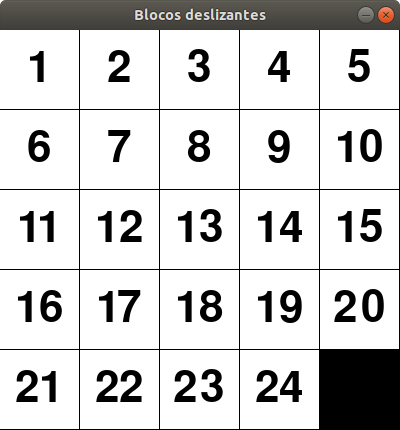

# Repositório para projetos da matéria Inteligência Artificial

## Projeto 1: Resolução de Problemas através de Busca

Duas abordagens foram utilizadas para a solução: busca gulosa e busca A*.

### Blocos deslizantes

O problema consiste num tabuleiro quadrado com peças que podem se mover vertical e horizontalmente para ocupar o espaço vazio. O objetivo é mover as peças até que as peças fiquem nas posições obedecendo a sequência dos números. A imagem a seguir mostra um exemplo de tabuleiro de dimensões 5x5 já com as peças organizadas nas posições corretas.

    
    
<b>Figura.</b> Tabuleiro na posição final 

